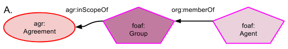

## How Agreements affect Agents

Unlike Agreements that did affect Agents, Agreements affecting Agents (i.e continuing to have an affect) are not a provenance scenario since it is not in the past, thus PROV-O relationships cannot be used. The simplest construct is given in Figure A where an Agent is a member of a Group and that Group is within the scope of (*inScopeOf*) an Agreement.

#### Namespaces
Prefix | URI
------ | ---
foaf | http://xmlns.com/foaf/0.1/#
org | http://www.w3.org/ns/org#
agr | http://promsns.org/def/agr#