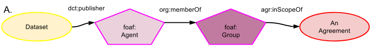

## How Agreements affect Entities

Unlike Agreements that did affect data, Agreements affecting data (i.e continuing to have an affect) are not a provenance scenario since it is not in the past, thus PROV-O relationships cannot be used. The simplest construct is given in Figure A which is the same as a provenance scenario except that the data is not *wasAttributedTo* but continues to be related to an Agent (best represented as a foaf:Agent, not a prov:Agent to avoid confusion) through a relationship with currency. Many relationships are possible, they could be direct, such as *dct:publisher*, or qualified, such as prov:Entity *provqualifiedAttribution* prov:Attribution [*prov:Agent* AnAgent, *ex:hadRole* SomeRole].

#### Namespaces
Prefix | URI
------ | ---
foaf | http://xmlns.com/foaf/0.1/#
agr | http://promsns.org/def/agr#