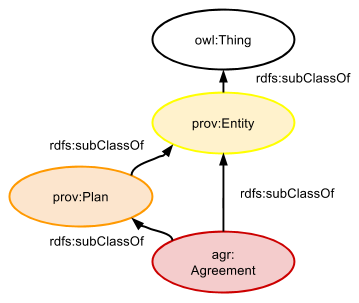

## How Agreements are Entities

An Agreement is a subclass of the PROV ontology’s Entity by this ontology's definition. From [PROV-O](https://www.w3.org/TR/prov-o/#Entity): "An entity is a physical, digital, conceptual, or other kind of thing with some fixed aspects; entities may be real or imaginary." So an Agreement not an occurent thing or action, which PROV-O would categorise as an Activity.

An Agreement is also a subclass of PROV's Plan. From [PROV-O](https://www.w3.org/TR/prov-o/#Plan): "A plan is an entity that represents a set of actions or steps intended by one or more agents to achieve some goals.". So an Agreement tells someone or some group what to do. The difference between an Agreement and a Plan is that an Agreement applies to a particular Agent (likely a foaf:Group).

#### Namespaces
Prefix | URI
------ | ---
agr | http://promsns.org/def/agr#
owl | http://www.w3.org/2002/07/owl#
prov | http://www.w3.org/ns/prov#
rdfs | http://www.w3.org/2000/01/rdf-schema#