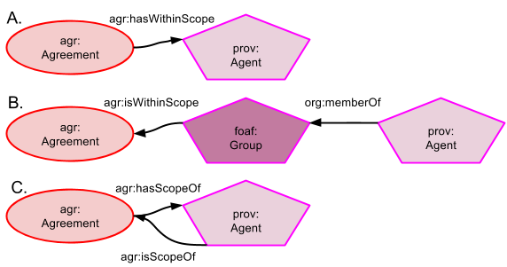

## Indicating Agreement / Agent relationships

Agreements may be show to affect Agents independent of any data or event objects as per Figures A, B & C. In Figure A, an Agreements has a particular Agent (individual or group) within its scope indicated by *agr:hasWithinScope* which is a subproperty of PROV-O's *prov:influenced*. It is likely that most Agents related to Agreements in this way will be groups and if the linking of the Agreement to individual Agents is required, then this may be indicated with normal FOAF or PRG ontology relationships such as using *org:memeberOf* to show that an individual Agent is within a particular group, as per Figure B. Figure B shows the inverse property for *agr:hasWithinScope*, namely *agr:isWithinScope* in use.

Figure C shows the relationship between an Agreement and all the Agents - the total set - that it affects as being *agr:hasScopeOf* with the inverse *agr:isScopeOf*. Individual Agents or subgroups of the total set are indicated by *agr:hasWithinScope* / *agr:isWithinScope* as per figures A & B. This group may or may not be deliberately specified anywhere. A deliberate specification might be a consortium bound by a particular agreement such as a data sharing agreement or a peace treaty. An non-specification scenario could be the adherence to a dataset's license where the Agreement is the license and the scope group is the total set of users of the dataset who adhere to its terms; a group unknown to the dataset or licnese creator.

#### Namespaces
Prefix | URI
------ | ---
agr | http://promsns.org/def/agr#
foaf | http://xmlns.com/foaf/0.1/#
org | http://www.w3.org/ns/org#
