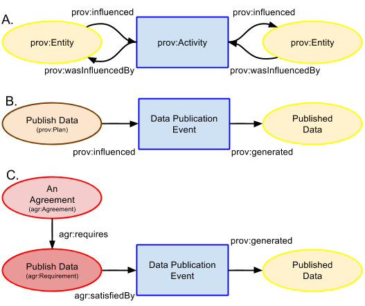
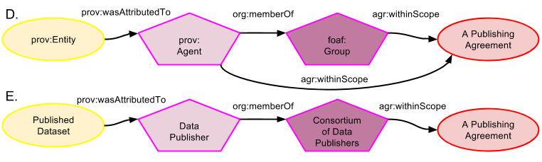

## Indicating Agreement / data relationships
Agreements can obviously affect data, or any other thing. They may mandate the production, release, attribution, cost of use or any other aspect of the thing. The [PROV ontology](https://www.w3.org/TR/prov-o/) considers a "physical, digital, conceptual, or other kind of thing with some fixed aspects" whether real or imaginary, to be an *Entity* thus, in PROV-O parlance, we consider Agreements' affect on Entities to include Agreements' affect on data.

### Via Events

Making data is a specialised case of *affecting* data. In PROV-O, the simplest relationship between Entity and an event (a PROV-O *Activity*), perhaps that which produced or published it, is where an Entity *wasInfluencedBy* an Activity (inverse an Activity *influenced* and Entity). An Entity may influence an Activity too, perhaps by laying out procedures to be followed. The generic relationships are shown in Figure A. Figure B specialises the relationships and class objects in Figure A with a prov:Plan (a subclass of Entity) providing instruction to a 'Data Generation Event' Activity which then produces a 'Generated Data' Entity. Figure C shows an Agreement having, as one of its Requirements, through Agreement *requires*, a Requirement to 'Publish Data' which is then *satisfiedBy* a 'Data Publication Event' Activity which then results in, *generates* a 'Published Data' Entity.
  
This example uses a data publication scenario but data creation, destruction, release, modification, sale or any other scenario can be constructed similarly. 

### Via Agents

Another way to see how an agreement could have affected an data is to see who or what the data Entity is attributed. It is more likely that the Agent associated with a data creation or modification event is recorded than particulars of the event itself (viz. many data catalogues store a 'creator' or a 'custodian' for a dataset but few store creation or publication event details other than perhaps a date). Figure D shows a PROV-O relationship whereby a dataset (Entity) is attributed to an Agent (attribution could be specialised to be creation, publication, alteration etc.) and a [FOAF](http://xmlns.com/foaf/spec/) relationship to place that Agent within a Group. Figure E extends on those generic PROV-O and FOAF relationships with Agreements ontology relationships whereby an Agent - either a single individual (prov:Person/foaf:Person) or a group (foaf:Group, org:Organization etc.) - can be indicated as being affected by an Agreement via a *agr:hasScopeOf* property. In this way, the transitive relationship back from an Agreement to an Entity via an Agent, or Agent and any number of Agent group/organization memberships, indicates an affect.

### Direct influence
As per PROV-O, anything may have *prov:influenced* anything else. The Agreements ontology specialises this with *agr:agreementFor* relationship between an Agreement and an Entity (data) with the inverse of *agr:hasAgreement*. This allows a direct relationship between an Agreement and an Entity to be expressed in a way similar to the commonly used [Dublin Core Terms](http://dublincore.org/documents/dcmi-terms/) relationship *dct:license* indicating a License (a specialised form of an Agreement) and data. In a specialised license scenario, the individual elements of the license which the [Creative Commons Rights Expression Language](http://labs.creativecommons.org/demos/ns/) calls 'Requirements', are indicated by Agreements ontology Requirements. 

### Temporal constraints
Since an Agreement is an Entity it can be given temporal bounds via usual PROV-O properties. These may include instantiation/creation (*prov:generatedAtTime* or, for the event (Activity), *prov:wasGeneratedBy*) or expiry/cessation/destruction (*prov:invalidatedAtTime* or, for the event (Activity) *prov:wasInvalidatedBy*).

Another way of placing temporal bounds on the effects of an Agreement on data is to alter the membership of the group that the Agreement affects. The creation or destruction of an Agent's membership of a group follows normal FOAF or ORG ontology constructs for *foaf:member* / *org:memberOf* relations between Agents and a Groups.

#### Namespaces
Prefix | URI
------ | ---
agr | http://promsns.org/def/agr#
dct | http://purl.org/dc/terms/
foaf | http://xmlns.com/foaf/0.1/#
org | http://www.w3.org/ns/org# 
prov | http://www.w3.org/ns/prov#
